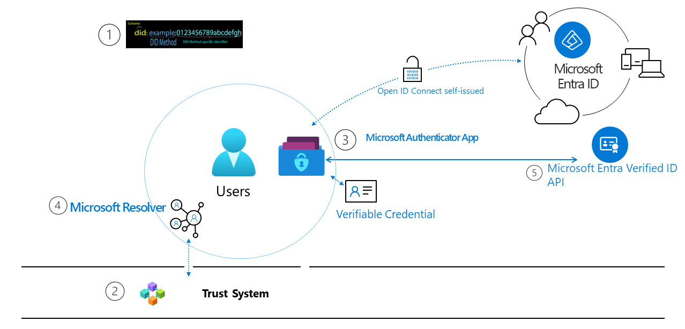

# Identity-Overlay-Network-Review-YouTube
---

## Identity Network Review

notes: Hello all. Welcome to the Identity Network Review Series where I provide concise explanations of popular identity networks. I look to answer questions like: Why would you choose said network?, Who is behind the development of the network? and How secure is the network? This presentation can be found on GitHub with the link in the description. 

---

## Identity Overlay Network (ION)

notes: In this episode I will cover the Identity Overlay Network or ION for short. ION is an open source network started by Microsoft in 2017 and launched in March of 2021. Before diving into the details, lets look at a popular ecosystem that is using ION.

---

## Entra Verified ID

 

notes: Microsoft is working with a diverse community to create a Decentralized Identity solution that puts individuals in control of their own digital identities, providing a secure and private way to manage identity data without relying on centralized authorities or intermediaries. 

Verified ID is a part of the Microsoft Entra tool suite targeted at businesses to help keep the company, it's employees and it's customers digitally secure. Microsoft has worked hard to make it easy for someone already in their Entra suite to add Verified ID. One notable use case is that with the credential you can have your workplace denoted with a *Verified* badge on LinkedIn. Increasing the trust that you provide during your next job search.

Lets move from the ecosystem to some of the technical bits now.

graphic source: https://learn.microsoft.com/en-us/entra/verified-id/decentralized-identifier-overview 

---

## Verifiable Data Registry

notes: The Verifiable Data Registry is a fancy term for where is the data stored and kept secure. ION uses the Sidetree protocol to anchor DID operations to the Bitcoin blockchain. *PAUSE* If you just panicked thinking that every DID operation will be a transaction, you can relax, because thats not how side tree works. 

Sidetree allows you to bundle upwards of 10,000 operations and store that bundle in IPFS, only putting one encoded hash into your Bitcoin transaction. This means that ION nodes would query IPFS for the DID information and be able to check the associated Bitcoin hash to ensure that the data had not been corrupted in any way. 

Speaking of DID operations.

---

## DID Method and Operations

`did:ion`

### Operations
- Create
- Update
- Recover
- Deactivate

notes: ION uses the `did:ion` method. The method is mainly for the DID universal resolver. These did operations are also very standard for digital identity networks. You might have noticed that instead that instead of delete there is deactivate. To be DID Core compliant it must be this way. 

---

## Reasons to Choose ION

- Well Promoted and Supported
- Anchored to Bitcoin
- Open Source

notes: ION has some compelling reasons why you would choose it. Microsoft has put some effort behind the project not only from a development stand point, but also from a marketing and integrations perspective. ION currently seems like a popular choice for SAAS companies to support. 

Being anchored to Bitcoin means that it will remain the most secure networks for the foreseeable future. Combine that with being fully open source, you are not reliant on anyone to participate in your digital ecosystem. 

If you are looking to easily connect your identity ecosystem to a smart contract blockchain, then you might be better off with one of the other networks in this series.  

---

## ION

notes: I hope you learned something. There will be a link in the description to the GitHub repository where you can find the presentation and the script. 

If you liked the content then click the link to watch the rest of the playlist. 

---