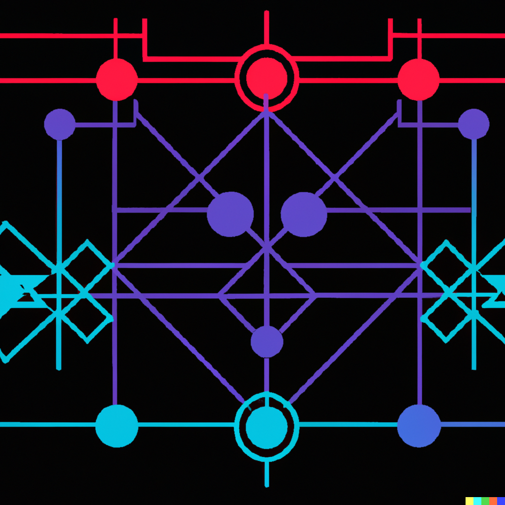
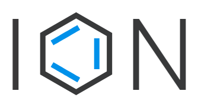

# Identity-Overlay-Network-Review-YouTube
---

## Identity Network Review

notes:

---

## Identity Overlay Network (ION)

notes:

---

## Application

notes:

---

## Verifiable Data Registry
TODO: add bitcoin logo image

notes: Verifiable Data Registry is a fancy term for where is the data stored and kept secure.  

---

## DID method(s)

`did:ion`

notes: 

---

## Who develops ION?

notes:

---

## Pros to choosing ION

notes:

---

## Cons

notes: Syncing transactions will require you to own bitcoin and submit transactions

---

## Closing

notes:

---